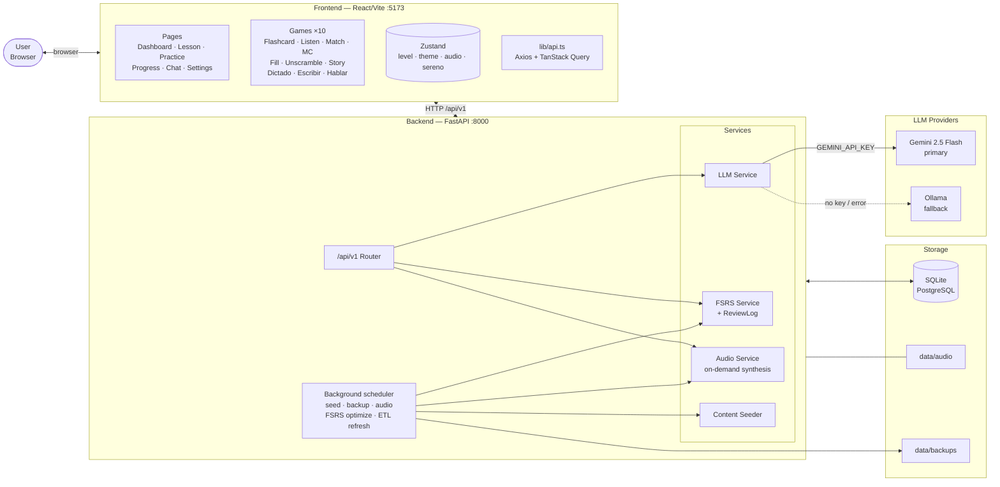
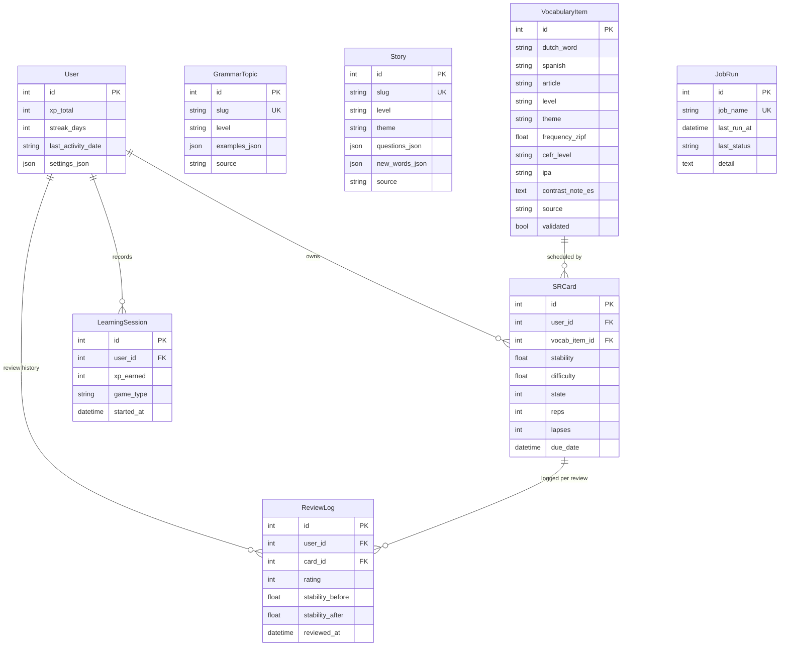
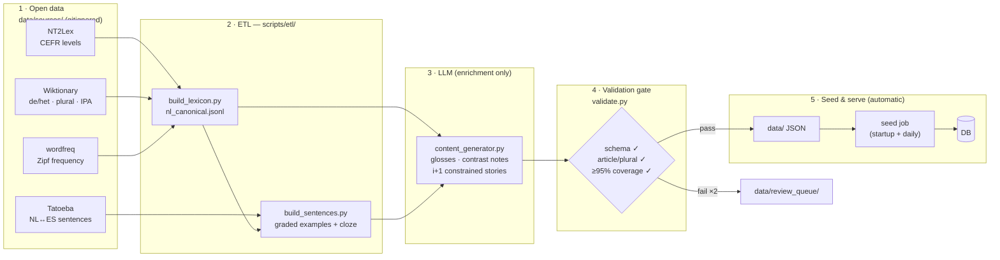
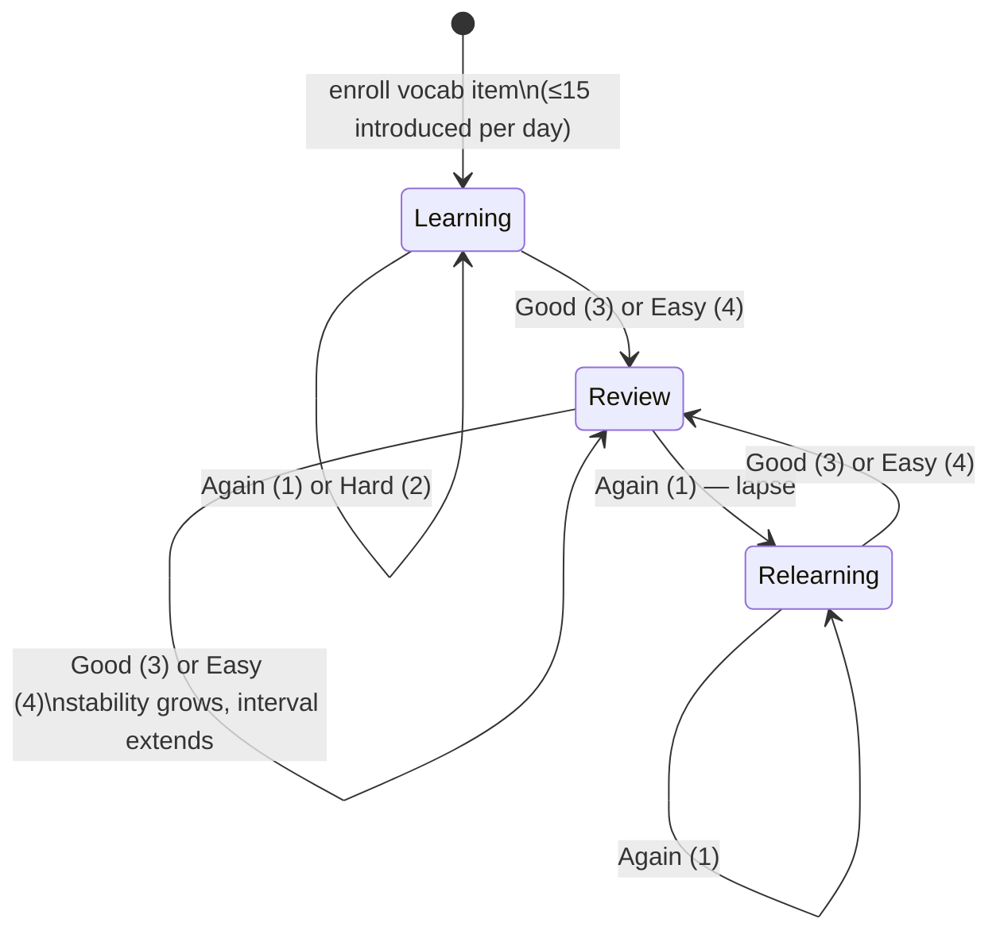
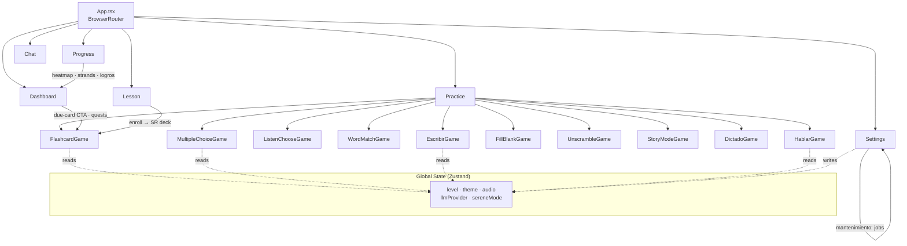

# Nederlands Leren 🇳🇱

A web-based Dutch ↔ Spanish language learning app targeting CEFR levels A0–A2.
The interface and all explanations are in **Spanish** — aimed at Spanish speakers learning Dutch.

Pedagogy, gamification, and UI follow a research-grounded design: retrieval practice and FSRS spacing, Nation's four strands, Self-Determination Theory for the game layer, and Mayer's multimedia principles for the UI. The day-to-day routine is described in [`docs/USAGE_PROTOCOL.md`](docs/USAGE_PROTOCOL.md).

---

## Features

### Learning

- **10 game types**: Flashcards (FSRS), Listen & Choose, Word Match, Multiple Choice, Fill in Blank, Sentence Unscramble, Story Mode, Dictado, **Escribir** (typed ES→NL production with article-aware grading) and **Hablar** (Web Speech API pronunciation practice, Chromium)
- **Spaced repetition** with the [FSRS algorithm](https://github.com/open-spaced-repetition/fsrs4anki): desired retention 0.90, daily new-card cap (15), per-review `ReviewLog` history, and automatic parameter optimization once ≥1,000 reviews accrue
- **Elaborative feedback**: wrong answers get an LLM explanation in Spanish, rendered next to the answer; wrong *de/het* articles get a targeted contrast note
- **"Trampas del neerlandés"**: curated contrastive lessons for Spanish speakers (V2 word order, separable verbs, de/het, *er*, false friends)
- **LLM integration**: grammar explanations, wrong-answer feedback, vocabulary-constrained i+1 story generation, Dutch conversation chat — Gemini primary, Ollama fallback

### Gamification (SDT-designed)

- **Mastery first**: the headline metric is "Dominas N palabras" (cards with FSRS stability >21 days), not XP
- **Tiered, visible achievement map** (17 badges) with progress bars toward every tier
- **Optional daily quests** (4 categories, rotating, skippable without penalty)
- **Streak with earnable freeze**: one freeze banked per 7-day streak; bridges a single missed day automatically
- **In-session combo** (×1.5 XP after 5 correct) and end-of-session summaries (accuracy, XP, promoted cards)
- **Modo sereno**: hides XP/combos entirely for score-free study
- **Progress page**: 365-day activity heatmap, weekly XP chart, four-strands balance meter (input / output / study / fluency)

### Operations (automated)

- **Background scheduler** inside the backend process — no manual maintenance:
  auto-seed on startup, daily progress backups, daily audio gap-fill, weekly FSRS optimization, opt-in weekly content refresh (ETL)
- **Maintenance panel** in Settings: job status, last run, run-now buttons
- **On-demand audio**: `GET /api/v1/vocabulary/{id}/audio` resolves/synthesizes audio server-side — games never depend on files existing
- **Curate-first content pipeline** (`backend/scripts/etl/`): open data (NT2Lex, Wiktionary, Tatoeba, wordfreq) provides the facts; the LLM only enriches and gap-fills; a validation gate enforces article/plural correctness and ≥95% i+1 story coverage
- **License hygiene**: per-item `source`/`license`/`attribution` columns; `ATTRIBUTIONS.md` regenerated on every seed

### Platform

- Keyboard-first play (Space = flip, 1–4 = rate, Enter = continue), 0.7× slow audio replay, WCAG AA color contrast and focus rings
- Dark mode throughout; Duolingo-inspired design (Inter font, brand green fills with AA-compliant text greens)
- Progress export/import (includes the full FSRS review history)
- Single-user, local-first — no authentication; SQLite (dev) or PostgreSQL (prod)

---

## Quick Start — Local Dev

### Prerequisites

- Python 3.12+, [uv](https://docs.astral.sh/uv/getting-started/installation/)
- Node 20+ (via [nvm](https://github.com/nvm-sh/nvm): `nvm install 20`)
- Optional: Ollama running locally (app works without it — Gemini is the default provider)

### 1. Backend

```bash
cd backend

uv venv .venv
source .venv/bin/activate

uv pip install -r requirements.txt

# Start the API — the database is created and seeded automatically on startup
uvicorn app.main:app --reload
# → http://localhost:8000
# → http://localhost:8000/docs  (Swagger UI)
```

### 2. Frontend

```bash
cd frontend
npm install
npm run dev
# → http://localhost:5173
```

The Vite dev server proxies `/api` and `/audio` to `localhost:8000` automatically.

---

## Configuration

All settings are read from `backend/.env` (copy from `.env.example`).

| Variable | Default | Description |
|---|---|---|
| `SECRET_KEY` | `change-me-in-production` | Change for production deployments |
| `DATABASE_URL` | `sqlite:///…/data/app.db` | SQLAlchemy connection string |
| `LLM_PROVIDER` | `gemini` | `gemini` \| `ollama` |
| `GEMINI_API_KEY` | _(empty)_ | Required for Gemini LLM and TTS |
| `GEMINI_MODEL` | `gemini-2.5-flash` | Model used for content/chat |
| `GEMINI_TTS_MODEL` | `gemini-2.5-flash-preview-tts` | TTS model for audio generation |
| `OLLAMA_BASE_URL` | `http://ollama:11434` | Ollama endpoint |
| `OLLAMA_MODEL` | `mistral:7b-instruct-q4_K_M` | Model to use with Ollama |
| `PIXABAY_API_KEY` | _(empty)_ | Free key for vocabulary images |
| `AUDIO_DIR` | `…/data/audio` | Where audio files are stored/served |

### Automation flags

| Variable | Default | Description |
|---|---|---|
| `SCHEDULER_ENABLED` | `true` | Master switch for the background job loop |
| `AUTO_SEED` | `true` | Seed `data/` JSON into the DB on startup + daily (idempotent) |
| `AUTO_BACKUP` | `true` | Daily progress export to `data/backups/` |
| `AUTO_AUDIO_GAPFILL` | `true` | Daily gTTS synthesis for vocabulary without audio |
| `AUTO_FSRS_OPTIMIZE` | `true` | Weekly FSRS parameter optimization (needs `pip install "fsrs[optimizer]"`) |
| `AUTO_CONTENT_REFRESH` | `false` | Weekly full ETL refresh — **large downloads**, enable deliberately |
| `BACKUP_RETENTION` | `14` | Number of daily backups to keep |
| `AUDIO_GAPFILL_BATCH` | `50` | Max audio syntheses per job run |
| `SCHEDULER_TICK_SECONDS` | `1800` | Scheduler wake-up interval |

---

## Background Jobs & Maintenance

The backend runs an in-process scheduler (asyncio — no Celery/Redis needed for a local deployment). Job status and manual triggers are in **Ajustes → Mantenimiento automático**, or via the API:

```bash
curl http://localhost:8000/api/v1/admin/jobs                       # status of all jobs
curl -X POST http://localhost:8000/api/v1/admin/jobs/backup_progress/run   # run one now
```

| Job | Cadence | What it does |
|---|---|---|
| `seed_content` | startup + daily | `data/` JSON → DB, regenerates `ATTRIBUTIONS.md` |
| `backup_progress` | daily | dated export to `data/backups/`, prunes by retention |
| `audio_gapfill` | daily | synthesizes audio for vocabulary that has none |
| `fsrs_optimize` | weekly | recomputes FSRS parameters from your review history (≥1,000 logs) |
| `content_refresh` | weekly (opt-in) | full ETL pipeline + reseed |

---

## Content Pipeline (curate-first)

Authoritative facts come from open data — never from the LLM:

| Source | Provides | License |
|---|---|---|
| [NT2Lex](https://github.com/anaistack/NT2Lex) | CEFR level per lemma | CC BY-NC-SA 4.0 |
| [Wiktionary (kaikki.org)](https://kaikki.org/dictionary/Dutch) | de/het article, plural, IPA, ES glosses | CC BY-SA 3.0 |
| [Tatoeba](https://tatoeba.org) | NL↔ES example sentences + cloze material | CC BY 2.0 FR |
| [`wordfreq`](https://pypi.org/project/wordfreq/) | Zipf frequency (SUBTLEX substitute) | MIT |

```bash
cd backend
python scripts/etl/fetch_sources.py            # download sources (large!) → data/sources/
python scripts/etl/build_lexicon.py            # → data/lexicon/nl_canonical.jsonl (+ conflicts)
python scripts/etl/build_sentences.py          # → graded NL↔ES sentences + per-lemma examples
python scripts/etl/validate.py --stamp         # the gate: schema, article/plural, ≥95% i+1 coverage
python scripts/etl/coverage_report.py          # level × theme completeness matrix
```

The validation gate sends failures to `data/review_queue/` instead of letting them reach the app. LanguageTool (`pip install language_tool_python`, needs Java) is used automatically when installed.

The LLM is used only for: choosing the best Spanish gloss, contrast notes, vocabulary-constrained i+1 stories (`generate_story_constrained` — known words + ≤5 new, regenerated until the coverage gate passes), and adapting grammar explanations.

### Manual content scripts (still available)

```bash
python scripts/seed_content.py                                   # manual seed (auto on startup)
python scripts/gemini_tts.py --type vocabulary --level a0        # high-quality TTS (GEMINI_API_KEY)
python scripts/populate_images.py --level a0                     # Pixabay images (PIXABAY_API_KEY)
python scripts/populate_content.py --levels a1 --types vocab --batch   # LLM batch generation
```

---

## Testing

### Backend

```bash
cd backend && source .venv/bin/activate
uv pip install -r requirements-dev.txt   # first time

pytest                                   # all tests (scheduler disabled in tests)
pytest --cov=app --cov-report=term-missing
pytest tests/unit/test_spaced_repetition.py::test_new_card_state   # single test
```

Coverage threshold: ≥70% (enforced in CI).

### Frontend

```bash
cd frontend
npm run test            # single run
npm run test:watch      # watch mode
npm run test:coverage   # v8 coverage report
```

### Linting & type checking

```bash
# Backend
cd backend && source .venv/bin/activate
ruff check app/           # lint
mypy app/                 # type check
bandit -r app/ -c pyproject.toml  # security scan

# Frontend
cd frontend
npm run lint              # ESLint (0 warnings allowed)
npm run type-check        # tsc --noEmit
npm run format            # Prettier
```

---

## Adding Content

All content is plain JSON in `data/` — no code changes needed, and the seed job picks it up automatically (startup/daily, or run it from Settings).

**Add vocabulary** — append to `data/vocabulary/a0_words.json` (or `a1_words.json`):

```json
{
  "dutch_word": "bibliotheek",
  "english": "library",
  "spanish": "biblioteca",
  "article": "de",
  "plural": "bibliotheken",
  "word_type": "noun",
  "level": "a1",
  "theme": "educacion",
  "example_nl": "Ik lees in de bibliotheek.",
  "example_es": "Leo en la biblioteca."
}
```

Optional curated/pipeline fields: `frequency_zipf`, `cefr_level`, `ipa`, `contrast_note_es`, `cloze_sentences_json`, `source`, `source_license`, `attribution`, `validated`.

**Add grammar topics** — append to `data/grammar/a0_grammar.json` (see `data/grammar/trampas_grammar.json` for contrastive examples):

```json
{
  "slug": "present-tense",
  "name_nl": "Tegenwoordige tijd",
  "name_es": "Presente de indicativo",
  "level": "a0",
  "description_es": "El presente se forma con la raíz del verbo + terminaciones.",
  "examples_json": [
    { "nl": "Ik werk.", "es": "Yo trabajo.", "notes": "raíz: werk" }
  ]
}
```

**Add stories** — append to `data/stories/a0_stories.json`:

```json
{
  "slug": "de-markt",
  "title_nl": "De markt",
  "title_es": "El mercado",
  "level": "a0",
  "theme": "ciudad",
  "content_nl": "Anna gaat naar de markt.",
  "content_es": "Anna va al mercado.",
  "questions_json": [
    {
      "question_es": "¿Adónde va Anna?",
      "options": ["de markt", "het park", "de school"],
      "answer_index": 0,
      "explanation_es": "El texto dice que Anna va al mercado."
    }
  ]
}
```

Run `python scripts/etl/validate.py` to check new content against the gate before it ships.

---

## Progress Backup

Backups happen **automatically every day** to `data/backups/` (retention configurable). Manual options from the **Settings** page:

- **Exportar progreso** — downloads a `progress-YYYY-MM-DD.json` with all SR cards, sessions, review logs, and user stats
- **Importar progreso** — restores after a reinstall or Docker rebuild; merges cards by vocab ID

Via the API directly:

```bash
curl http://localhost:8000/api/v1/progress/export -o progress-backup.json

curl -X POST http://localhost:8000/api/v1/progress/import/json \
  -H "Content-Type: application/json" \
  -d @progress-backup.json
```

---

## API Reference

| Method | Path | Description |
|--------|------|-------------|
| GET | `/api/v1/health` | Health check |
| GET | `/api/v1/vocabulary/` | List vocabulary (`?level=a0&theme=animales`) |
| GET | `/api/v1/vocabulary/{id}` | Single item |
| GET | `/api/v1/vocabulary/{id}/audio` | Audio for an item (resolved/synthesized on demand) |
| GET | `/api/v1/grammar/` | Grammar topics (`?level=a0`) |
| GET | `/api/v1/grammar/{slug}` | Single topic |
| GET | `/api/v1/stories/` | Story list (`?level=a0`) |
| GET | `/api/v1/stories/{slug}` | Story detail |
| GET | `/api/v1/progress/user` | User stats (XP, streak, achievements) |
| GET | `/api/v1/progress/stats` | Mastery metrics (mastered words, stories, freezes) |
| GET | `/api/v1/progress/due` | Due FSRS cards (new cards capped at 15/day) |
| POST | `/api/v1/progress/review` | Submit review rating 1–4 (`combo` applies ×1.5 XP); writes a ReviewLog |
| POST | `/api/v1/progress/enroll/{id}` | Add vocab item to SR deck |
| POST | `/api/v1/progress/session-complete` | Report a non-FSRS game round (XP, quests, strands) |
| POST | `/api/v1/progress/story-complete` | Report a story quiz result |
| GET | `/api/v1/progress/quests` | Today's optional quests (rotating, with progress) |
| GET | `/api/v1/progress/strands` | Weekly activity per learning strand |
| GET | `/api/v1/progress/history` | Daily XP for last N days (`?days=365` for the heatmap) |
| GET | `/api/v1/progress/settings` | User settings JSON |
| PUT | `/api/v1/progress/settings` | Update user settings |
| GET | `/api/v1/progress/export` | Full progress export (incl. review logs) |
| POST | `/api/v1/progress/import/json` | Restore from export file |
| GET | `/api/v1/admin/jobs` | Background job status |
| POST | `/api/v1/admin/jobs/{name}/run` | Trigger a job now |
| GET | `/api/v1/exercises/listen-choose` | Listen & choose exercise |
| GET | `/api/v1/exercises/word-match` | Word match pairs (`?count`, default 6, max 10) |
| GET | `/api/v1/exercises/fill-blank` | Fill-in-blank exercise |
| GET | `/api/v1/exercises/unscramble` | Sentence unscramble exercise |
| POST | `/api/v1/llm/explain` | Explain a Dutch word/phrase |
| POST | `/api/v1/llm/feedback` | Wrong-answer feedback |
| POST | `/api/v1/llm/chat` | Dutch conversation chat (optional `provider` override) |
| GET | `/api/v1/content/levels` | Available CEFR levels with descriptions |
| GET | `/api/v1/content/themes/{level}` | Suggested themes for a CEFR level |
| POST | `/api/v1/content/generate/vocabulary` | LLM-generate vocabulary items |
| POST | `/api/v1/content/generate/grammar` | LLM-generate one grammar topic |
| POST | `/api/v1/content/generate/story` | LLM-generate one story |
| POST | `/api/v1/content/generate/exercise` | LLM-generate one game exercise |

Full interactive docs at `http://localhost:8000/docs`.

---

## Docker Compose

### Dev (hot-reload)

```bash
docker compose -f docker-compose.dev.yml up
```

| Service  | URL |
|----------|-----|
| Frontend | http://localhost:5173 |
| API      | http://localhost:8000 |
| API docs | http://localhost:8000/docs |

### Production

```bash
cp .env.example .env   # set GEMINI_API_KEY, SECRET_KEY, etc.
docker compose up --build
```

| Service | URL |
|---------|-----|
| App     | http://localhost:80 |
| API     | http://localhost:8000 |

The scheduler runs inside the backend container — no extra services needed.

---

## CI

GitHub Actions runs on every push/PR to `master` when the relevant paths change:

| Workflow | Triggers | Steps |
|---|---|---|
| `backend-ci.yml` | `backend/**` | ruff → mypy → bandit → pytest (≥70% coverage) |
| `frontend-ci.yml` | `frontend/**` | ESLint → tsc → vitest |

---

## Architecture

### System Overview



---

### Database Schema



---

### Flashcard Review Flow

Every card rating triggers a ReviewLog row, streak tracking (with freeze logic), XP (with combo multiplier), a session record, and achievement checks in a single request.

```mermaid
sequenceDiagram
    actor User
    participant FE as FlashcardGame.tsx
    participant API as POST /progress/review
    participant FSRS as spaced_repetition.py
    participant DB as SQLite

    User->>FE: flip card (Space) → see answer
    User->>FE: rate 1–4 (keys or buttons)
    FE->>API: { card_id, rating, combo }

    API->>FSRS: review_card(card_id, rating, xp_multiplier)
    FSRS->>FSRS: compute next due date,\nupdate stability + difficulty
    FSRS->>DB: save SRCard + INSERT ReviewLog
    FSRS-->>API: (updated_card, xp_earned)

    API->>API: _update_streak(user) — may consume a freeze
    API->>DB: INSERT LearningSession(xp_earned)
    API->>API: _check_achievements(user) — incl. mastery tiers
    API->>DB: UPDATE User

    API-->>FE: { next_due, xp_earned, new_achievements }
    FE->>User: advance; session summary at the end
```

---

### Content Pipeline (curate-first)



---

### FSRS Card States

Cards move through states driven by review ratings (fsrs 6.x: fresh cards start in Learning; "new" = never reviewed). A lapse (rating 1 in Review) sends the card back to Relearning. Cards with stability >21 days count as **mastered**.



---

### Frontend Page & Component Map



---

## Roadmap

Done across the recent iterations: 10 games (incl. typed/spoken production), SDT gamification layer (mastery metrics, tiered badges, quests, streak freeze, combo, modo sereno), ReviewLog + FSRS tuning, four-strands meter, heatmap, ETL pipeline with validation gate, background automation, on-demand audio, Trampas lessons, WCAG/keyboard pass.

Next up (handoff Waves 3/5 remainder):

- [ ] **Unit/lesson path**: ordered units with ≥80% checkpoint quizzes; placement quiz on first launch
- [ ] **Card progression per item**: recognition → typed production → cloze (Escribir wired into FSRS ratings)
- [ ] **Oído real**: Common Voice transcription exercises (real native audio, CC0)
- [ ] **Run the ETL with real data**: download NT2Lex/kaikki/Tatoeba locally, build the lexicon, regenerate the 25 A0 stories that currently fail the coverage gate (`data/review_queue/`)
- [ ] **Minimal-pair listening drills** from Wiktionary IPA (man/maan, bot/boot)
- [ ] **PWA**: offline reviews with a sync queue; cached audio
- [ ] **Images in flashcards** + Listen & Choose (Pixabay, sense-disambiguated)
- [ ] **Piper TTS** as the local bulk-audio default (no API quota)

---

## Repository Layout

```
nederlands-leren/
├── .github/workflows/        # backend-ci.yml + frontend-ci.yml
├── backend/
│   ├── app/
│   │   ├── api/v1/           # Route handlers (vocabulary, grammar, stories, progress, exercises, llm, content, admin)
│   │   ├── core/config.py    # Pydantic settings — all env vars incl. automation flags
│   │   ├── db/models.py      # SQLAlchemy ORM models (incl. ReviewLog, JobRun)
│   │   ├── schemas/          # Pydantic request/response schemas
│   │   └── services/
│   │       ├── spaced_repetition.py   # FSRS wrapper: retention 0.90, new-card cap, ReviewLog
│   │       ├── scheduler.py           # in-process background job loop
│   │       ├── jobs.py                # backup, audio gap-fill, FSRS optimize, content refresh
│   │       ├── content_seeder.py      # idempotent seeding + ATTRIBUTIONS.md
│   │       ├── llm_service.py         # Gemini + Ollama fallback
│   │       ├── audio_service.py       # on-demand resolution + gTTS synthesis
│   │       └── content_generator.py   # LLM enrichment + constrained i+1 stories
│   ├── scripts/
│   │   ├── etl/              # fetch_sources, build_lexicon, build_sentences, validate, coverage_report
│   │   └── …                 # seed_content, gemini_tts, populate_content, populate_images
│   ├── tests/                # unit/ + integration/ (in-memory SQLite, scheduler disabled)
│   ├── alembic/              # Database migrations
│   ├── pyproject.toml        # ruff, mypy, bandit config
│   └── requirements*.txt
├── frontend/
│   ├── src/
│   │   ├── components/games/ # 10 game components
│   │   ├── components/SessionSummary.tsx
│   │   ├── pages/            # Dashboard, Lesson, Practice, Progress, Chat, Settings
│   │   ├── stores/appStore.ts
│   │   ├── lib/api.ts        # Axios client + all API helpers + TypeScript types
│   │   └── test/             # MSW handlers, renderWithProviders, Vitest setup
│   ├── tailwind.config.js
│   └── vite.config.ts
├── data/
│   ├── vocabulary/           # per-level word JSON
│   ├── grammar/              # per-level grammar + trampas_grammar.json
│   ├── stories/              # per-level stories
│   ├── audio/                # generated audio (gitignored)
│   ├── backups/              # automatic daily progress backups (gitignored)
│   ├── sources/ · lexicon/ · sentences/ · review_queue/   # ETL artifacts (gitignored)
│   └── …
├── docs/USAGE_PROTOCOL.md    # daily/weekly routine + automated operations
├── ATTRIBUTIONS.md           # generated license attributions
├── docker-compose.yml
├── docker-compose.dev.yml
└── .env.example
```
