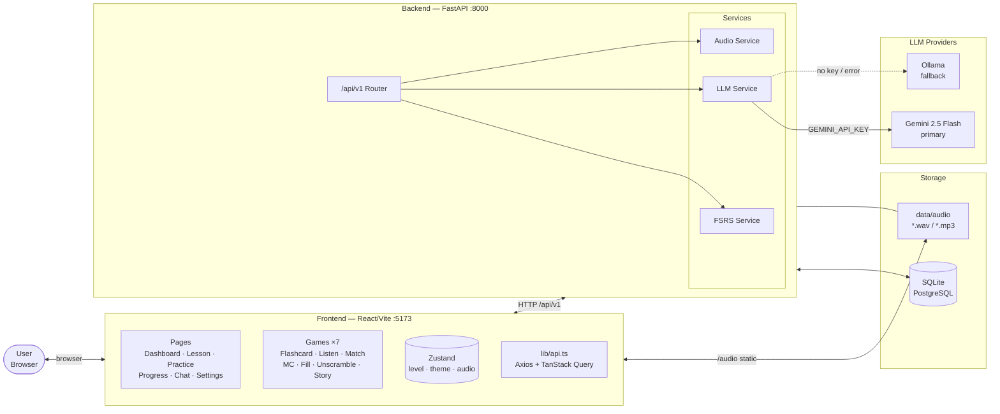
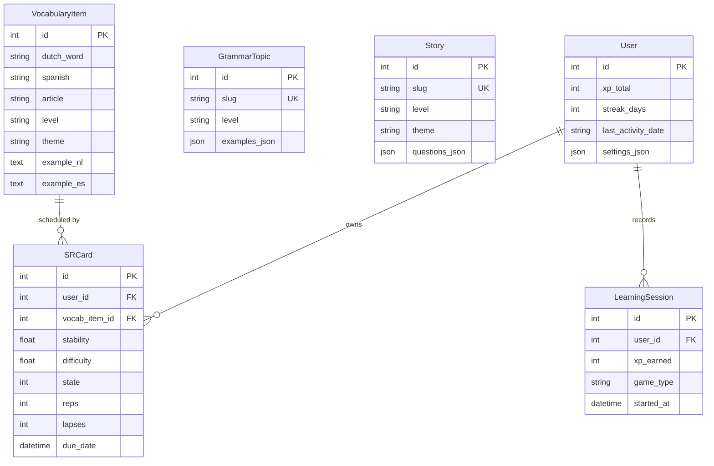
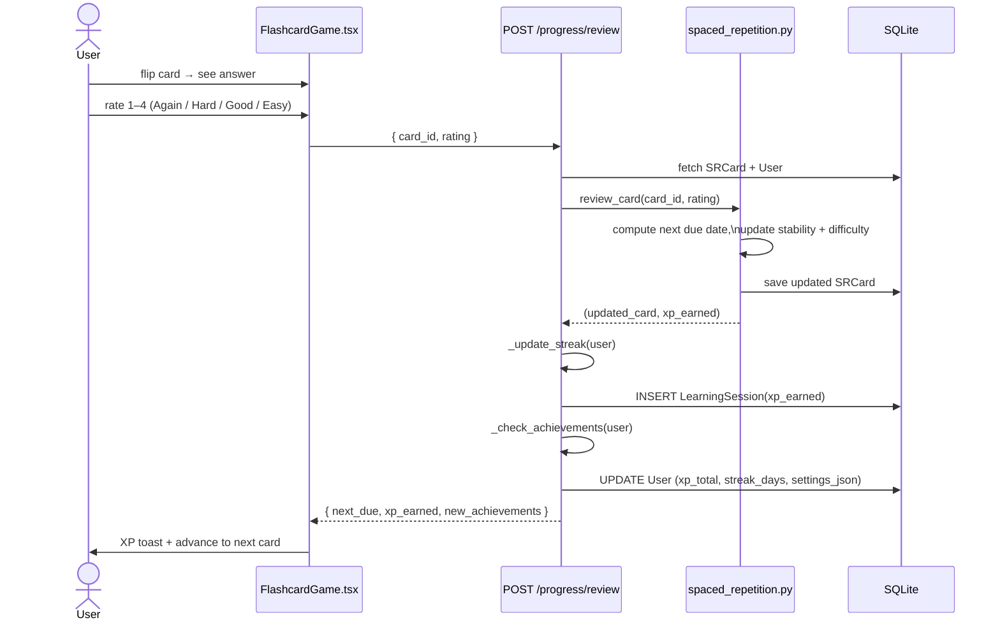
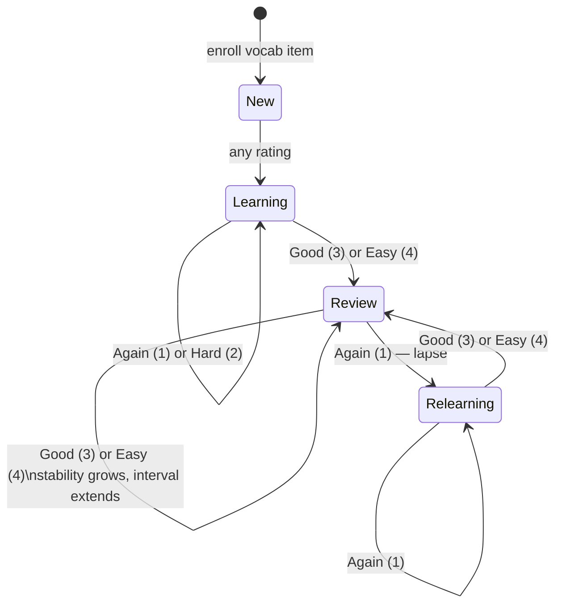
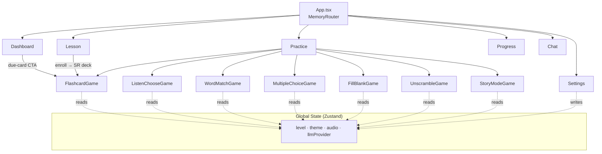
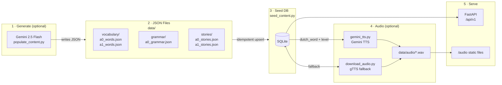
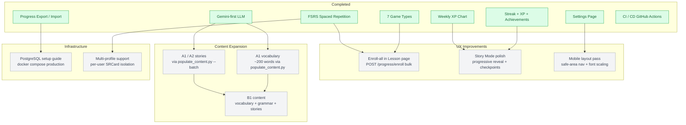

# Nederlands Leren 🇳🇱

A web-based Dutch ↔ Spanish language learning app targeting CEFR levels A0 and A1.  
The interface and all explanations are in **Spanish** — aimed at Spanish speakers learning Dutch.

---

## Features

- **7 game types**: Flashcards (FSRS spaced repetition), Listen & Choose, Word Match, Multiple Choice, Fill in Blank, Sentence Unscramble, Story Mode
- **Spaced repetition** with the [FSRS algorithm](https://github.com/open-spaced-repetition/fsrs4anki) — cards schedule themselves; streak tracking and XP per review
- **LLM integration**: grammar explanations, wrong-answer feedback, dynamic exercise generation, Dutch conversation chat — Gemini primary, Ollama fallback
- **Audio**: Gemini 2.5 Flash TTS for high-quality Dutch audio (Northern Dutch accent); gTTS as fallback
- **Progress tracking**: daily XP bar chart, achievement badges (6 built-in), due-card CTA on dashboard
- **Progress backup**: export full progress to JSON; import it back after reinstalls or migrations
- **Settings page**: level selector, audio toggle, LLM provider, dark/light mode
- **Dark mode** throughout; Duolingo-inspired design (brand green `#58CC02`, Inter font)
- Single-user — no authentication; SQLite (dev) or PostgreSQL (prod)

---

## Quick Start — Local Dev

### Prerequisites

- Python 3.12+, [uv](https://docs.astral.sh/uv/getting-started/installation/)
- Node 20+ (via [nvm](https://github.com/nvm-sh/nvm): `nvm install 20`)
- Optional: Ollama running locally (app works without it — Gemini is the default provider)

### 1. Backend

```bash
cd backend

uv venv .venv
source .venv/bin/activate

uv pip install -r requirements.txt

# Seed the database from data/ JSON files (idempotent — safe to re-run)
python scripts/seed_content.py

# Start the API
uvicorn app.main:app --reload
# → http://localhost:8000
# → http://localhost:8000/docs  (Swagger UI)
```

### 2. Frontend

```bash
cd frontend
npm install
npm run dev
# → http://localhost:5173
```

The Vite dev server proxies `/api` and `/audio` to `localhost:8000` automatically.

---

## Configuration

All settings are read from `backend/.env` (copy from `.env.example`).

| Variable | Default | Description |
|---|---|---|
| `SECRET_KEY` | `change-me-in-production` | Change for production deployments |
| `DATABASE_URL` | `sqlite:///…/data/app.db` | SQLAlchemy connection string |
| `LLM_PROVIDER` | `gemini` | `gemini` \| `ollama` |
| `GEMINI_API_KEY` | _(empty)_ | Required for Gemini LLM and TTS |
| `GEMINI_MODEL` | `gemini-2.5-flash` | Model used for content/chat |
| `GEMINI_TTS_MODEL` | `gemini-2.5-flash-preview-tts` | TTS model for audio generation |
| `OLLAMA_BASE_URL` | `http://ollama:11434` | Ollama endpoint |
| `OLLAMA_MODEL` | `mistral:7b-instruct-q4_K_M` | Model to use with Ollama |
| `PIXABAY_API_KEY` | _(empty)_ | Free key for vocabulary images |
| `AUDIO_DIR` | `…/data/audio` | Where audio files are stored/served |

---

## Seeding Content

### From JSON files (no API key required)

The `data/` directory contains JSON files for vocabulary, grammar, and stories. Seeding is idempotent.

```bash
cd backend && source .venv/bin/activate

# Load all JSON files into the database
python scripts/seed_content.py
```

### Generate audio

```bash
# High-quality Dutch audio via Gemini TTS (requires GEMINI_API_KEY)
python scripts/gemini_tts.py --type vocabulary          # all levels
python scripts/gemini_tts.py --type stories --level a0  # A0 stories only
python scripts/gemini_tts.py --type vocabulary --level a0 --max-items 5  # smoke test
python scripts/gemini_tts.py --type vocabulary --dry-run  # preview without writing

# gTTS fallback (no API key, lower quality)
python scripts/download_audio.py
```

Output: `gemini_<word>_<level>.wav` / `gemini_<slug>.wav` in `data/audio/`.

### Generate vocabulary images

```bash
# Requires PIXABAY_API_KEY in .env
python scripts/populate_images.py --level a0
python scripts/populate_images.py --level a1
```

### LLM content generation (A1/A2 expansion)

Requires `GEMINI_API_KEY` and `GEMINI_MODEL` in `.env`.

```bash
# Dry-run preview
python scripts/populate_content.py --levels a1 --types vocab --dry-run

# Generate A1 vocabulary and stories (batch API — cheaper, async)
python scripts/populate_content.py --levels a1 --types vocab stories --batch

# Generate A2 stories
python scripts/populate_content.py --levels a2 --types stories --batch

# Re-seed after generation
python scripts/seed_content.py
```

Themes and word counts are configured in `scripts/populate_config.json`.

---

## Testing

### Backend

```bash
cd backend && source .venv/bin/activate

# Install dev dependencies (first time)
uv pip install -r requirements-dev.txt

# Run all tests
pytest

# With coverage report
pytest --cov=app --cov-report=term-missing

# Single test
pytest tests/unit/test_spaced_repetition.py::test_new_card_state
```

Coverage threshold: ≥70% (enforced in CI).

### Frontend

```bash
cd frontend

npm run test            # single run
npm run test:watch      # watch mode
npm run test:coverage   # v8 coverage report
```

### Linting & type checking

```bash
# Backend
cd backend && source .venv/bin/activate
ruff check app/           # lint
ruff check app/ --fix     # lint + auto-fix
mypy app/                 # type check
bandit -r app/ -c pyproject.toml  # security scan

# Frontend
cd frontend
npm run lint              # ESLint (0 warnings allowed)
npm run type-check        # tsc --noEmit
npm run format            # Prettier
```

---

## Adding Content

All content is plain JSON in `data/` — no code changes needed.

**Add vocabulary** — append to `data/vocabulary/a0_words.json` (or `a1_words.json`):

```json
{
  "dutch_word": "bibliotheek",
  "english": "library",
  "spanish": "biblioteca",
  "article": "de",
  "plural": "bibliotheken",
  "word_type": "noun",
  "level": "a1",
  "theme": "educacion",
  "example_nl": "Ik lees in de bibliotheek.",
  "example_es": "Leo en la biblioteca."
}
```

**Add grammar topics** — append to `data/grammar/a0_grammar.json`:

```json
{
  "slug": "present-tense",
  "name_nl": "Tegenwoordige tijd",
  "name_es": "Presente de indicativo",
  "level": "a0",
  "description_es": "El presente se forma con la raíz del verbo + terminaciones.",
  "examples_json": [
    { "nl": "Ik werk.", "es": "Yo trabajo.", "notes": "raíz: werk" }
  ]
}
```

**Add stories** — append to `data/stories/a0_stories.json`:

```json
{
  "slug": "de-markt",
  "title_nl": "De markt",
  "title_es": "El mercado",
  "level": "a0",
  "theme": "ciudad",
  "content_nl": "Anna gaat naar de markt.",
  "content_es": "Anna va al mercado.",
  "questions_json": [
    {
      "question_es": "¿Adónde va Anna?",
      "options": ["de markt", "het park", "de school"],
      "answer_index": 0,
      "explanation_es": "El texto dice que Anna va al mercado."
    }
  ]
}
```

Re-seed after any changes:

```bash
cd backend && python scripts/seed_content.py
```

---

## Progress Backup

From the **Settings** page in the app:

- **Exportar progreso** — downloads a `progress-YYYY-MM-DD.json` file with all SR cards, sessions, and user stats
- **Importar progreso** — uploads that file to restore after a reinstall or Docker rebuild; merges cards by vocab ID

Via the API directly:

```bash
# Export
curl http://localhost:8000/api/v1/progress/export -o progress-backup.json

# Import
curl -X POST http://localhost:8000/api/v1/progress/import/json \
  -H "Content-Type: application/json" \
  -d @progress-backup.json
```

---

## API Reference

| Method | Path | Description |
|--------|------|-------------|
| GET | `/api/v1/health` | Health check |
| GET | `/api/v1/vocabulary/` | List vocabulary (`?level=a0&theme=animales`) |
| GET | `/api/v1/vocabulary/{id}` | Single item |
| GET | `/api/v1/grammar/` | Grammar topics (`?level=a0`) |
| GET | `/api/v1/grammar/{slug}` | Single topic |
| GET | `/api/v1/stories/` | Story list (`?level=a0`) |
| GET | `/api/v1/stories/{slug}` | Story detail |
| GET | `/api/v1/progress/user` | User stats (XP, streak, achievements) |
| GET | `/api/v1/progress/due` | Due FSRS cards (`?limit`, default 20, max 50) |
| POST | `/api/v1/progress/review` | Submit review rating (1–4); returns XP + new achievements |
| POST | `/api/v1/progress/enroll/{id}` | Add vocab item to SR deck |
| GET | `/api/v1/progress/history` | Daily XP for last N days (`?days=7`) |
| GET | `/api/v1/progress/settings` | User settings JSON |
| PUT | `/api/v1/progress/settings` | Update user settings |
| GET | `/api/v1/progress/export` | Full progress export (JSON file download) |
| POST | `/api/v1/progress/import/json` | Restore from export file |
| GET | `/api/v1/exercises/listen-choose` | Listen & choose exercise |
| GET | `/api/v1/exercises/word-match` | Word match pairs (`?count`, default 6, max 10) |
| GET | `/api/v1/exercises/fill-blank` | Fill-in-blank exercise |
| GET | `/api/v1/exercises/unscramble` | Sentence unscramble exercise |
| POST | `/api/v1/llm/explain` | Explain a Dutch word/phrase |
| POST | `/api/v1/llm/feedback` | Wrong-answer feedback |
| POST | `/api/v1/llm/chat` | Dutch conversation chat (optional `provider` override) |
| GET | `/api/v1/content/levels` | Available CEFR levels with descriptions |
| GET | `/api/v1/content/themes/{level}` | Suggested themes for a CEFR level |
| POST | `/api/v1/content/generate/vocabulary` | LLM-generate vocabulary items |
| POST | `/api/v1/content/generate/grammar` | LLM-generate one grammar topic |
| POST | `/api/v1/content/generate/story` | LLM-generate one story |
| POST | `/api/v1/content/generate/exercise` | LLM-generate one game exercise |

Full interactive docs at `http://localhost:8000/docs`.

---

## Docker Compose

### Dev (hot-reload)

```bash
docker compose -f docker-compose.dev.yml up
```

| Service  | URL |
|----------|-----|
| Frontend | http://localhost:5173 |
| API      | http://localhost:8000 |
| API docs | http://localhost:8000/docs |

### Production

```bash
cp .env.example .env   # set GEMINI_API_KEY, SECRET_KEY, etc.
docker compose up --build
```

| Service | URL |
|---------|-----|
| App     | http://localhost:80 |
| API     | http://localhost:8000 |

---

## CI

GitHub Actions runs on every push/PR to `master` when the relevant paths change:

| Workflow | Triggers | Steps |
|---|---|---|
| `backend-ci.yml` | `backend/**` | ruff → mypy → bandit → pytest (≥70% coverage) |
| `frontend-ci.yml` | `frontend/**` | ESLint → tsc → vitest |

---

## Architecture

### System Overview



---

### Database Schema



---

### Flashcard Review Flow

Every card rating triggers streak tracking, XP, a session record, and achievement checks in a single request.



---

### FSRS Card States

Cards move through four states driven by review ratings. A lapse (rating 1 in Review) sends the card back to Relearning.



---

### Frontend Page & Component Map



---

### Content Pipeline

How content moves from LLM generation to being served in the app.



---

## Planned Features



---

## Repository Layout

```
nederlands-leren/
├── .github/workflows/        # backend-ci.yml + frontend-ci.yml
├── backend/
│   ├── app/
│   │   ├── api/v1/           # Route handlers (vocabulary, grammar, stories, progress, exercises, llm, content)
│   │   ├── core/config.py    # Pydantic settings — all env vars
│   │   ├── db/models.py      # SQLAlchemy ORM models
│   │   ├── schemas/          # Pydantic request/response schemas
│   │   └── services/
│   │       ├── spaced_repetition.py   # FSRS Scheduler wrapper
│   │       ├── llm_service.py         # Gemini + Ollama fallback
│   │       ├── audio_service.py       # gTTS synthesis
│   │       └── content_generator.py   # LLM vocab/story/grammar generation
│   ├── tests/
│   │   ├── conftest.py       # In-memory SQLite fixtures, TestClient, rollback-per-test
│   │   ├── unit/
│   │   └── integration/
│   ├── alembic/              # Database migrations
│   ├── scripts/              # seed_content, gemini_tts, populate_content, populate_images, download_audio
│   ├── pyproject.toml        # ruff, mypy, bandit config
│   ├── requirements.txt
│   └── requirements-dev.txt
├── frontend/
│   ├── src/
│   │   ├── components/games/ # 7 game components
│   │   ├── components/layout/
│   │   ├── pages/            # Dashboard, Lesson, Practice, Progress, Chat, Settings
│   │   ├── stores/appStore.ts
│   │   ├── lib/api.ts        # Axios client + all API helpers + TypeScript types
│   │   └── test/             # MSW handlers, renderWithProviders, Vitest setup
│   ├── tailwind.config.js
│   └── vite.config.ts
├── data/
│   ├── vocabulary/           # a0_words.json, a1_words.json
│   ├── grammar/              # a0_grammar.json, a1_grammar.json
│   ├── stories/              # a0_stories.json, a1_stories.json, a2_stories.json
│   └── audio/                # generated audio files (gitignored)
├── docker-compose.yml
├── docker-compose.dev.yml
└── .env.example
```

---

## TODO

See the **Planned Features** diagram above for the full roadmap. Near-term priorities:

- [ ] Enroll-all button on Lesson page (`POST /progress/enroll` bulk endpoint)
- [ ] Story Mode: progressive reveal UX, checkpoints, scoring polish
- [ ] A1 vocabulary — run `populate_content.py --levels a1 --types vocab --batch` then `seed_content.py`
- [ ] Mobile responsive polish pass
- [ ] PostgreSQL production setup guide
